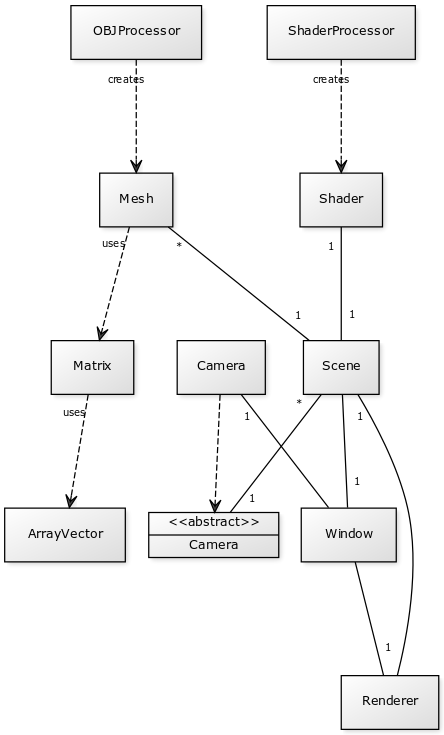

# Subject

Viw is a OBJ viewer written in Java. Viw comes with a orbiting camera and simple Blinn-Phong lighting model. Currently Viw doesn't support textures.


**Subject:** Software to view OBJ files.
**Users:** Generic user.

**User actions**
- Specify file to load
    - Succesfull if file exists and data is valid.
- Parse file
- Render file

# Description of code structure

The main method reads the launch arguments, and creates a window. After the window is initialized a `Renderer`, `Scene`, `Mesh` and `Shader` is created.
The mesh is loaded with the class `OBJLoader` which loads the obj file, parses it and registers them to the OpenGL state machine. Shaders are created with ShaderLoader, which work
similary to `OBJLoader`.

The `Window` class is responsible for creating a window, initializing all OpenGL systems and beginning the render loop. The `Renderer` class is responsible for
rendering a scene. The `Renderer::setCurrentScene` function will switch the current scene to a new scene.

There're also utilities for matrices and vectors. There are mainly used by `Camera` and `Mesh`.

# Diagrams

## Class diagram



### yUML script
```
[Renderer]-1[Scene], [Scene]*-1[\<\<abstract\>\> | Camera], [Window], [OBJProcessor]creates-.->[Mesh], [ShaderProcessor]creates-.->[Shader], [Camera]1-[Window], [Window]-1[Renderer], [Shader]1-1[Scene], [Mesh]*-1[Scene], [Camera]-.->[\<\<abstract\>\> | Camera], [ArrayVector], [Matrix], [Mesh]uses-.->[Matrix], [Matrix]uses-.->[ArrayVector],[Scene]-1[Window]

```

## Sequence diagrams

### Creating 3d model


### Creating window


